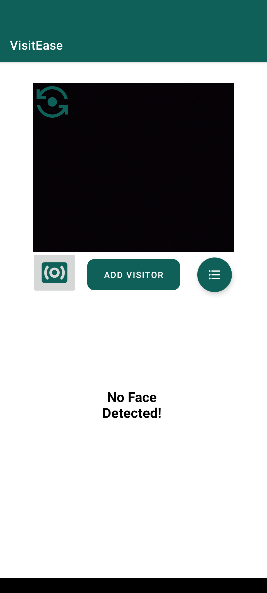
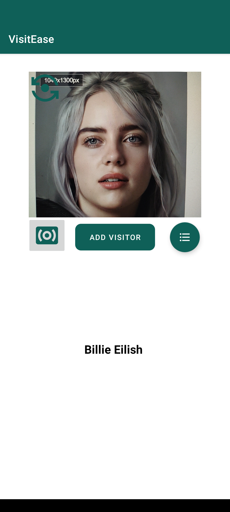

# VisitEase
### This an android application that helps you recognize visitors/members and keep a track of their activity.
This application was made for Microsoft Intern Engage 2022 program.

*Click on the links to view documentation/tutorials/etc. of that particular topic/technology.*

## Problem Statement:
### [Face Recognition](https://acehacker.com/microsoft/engage2022/index.html)
Develop a browser-based application or a native mobile application to demonstrate application of Face Recognition technology.

You could choose to demonstrate application of Face Recognition in any area of application of your choice, for example:

* Preventing crime
* Device security
* Smarter advertising
* Finding mission people or lost pets
* Diagnose diseases
* Tracking attendance
* Facilitate secure transactions
You are free to choose any Face API you are comfortable with.

## My Idea:
I visit a gym on a regular basis and I find the security guards and the employees having a hard time recognizing
the members, the staff gets transferred all the time from one branch of the gym to another. The gym members don't necessarily follow
a particular routine and they visit the gym at different times throughout the week, the staff at evening shift have a hard time recognizing
a member who usually visits the gym in the morning and vice-versa.
The biometric solution that is currently available is very complex and costly, so I decided to build an android application that helps with verifying the members
and adding any additional details about them.
I decided to make the application in such a way that it can run on low end android phones too and without the use of internet to further reduce the cost.
I designed the UI in a very minimalistic way so that someone who's not very familiar with the technology can also use it effectively and we also know
that a security guard might not be very familiar with using such applications.

## What application of the Face Recognition technology am I demonstrating?
### I am demonstrating: Preventing crime -> Biometric verification using the person's face.

## Getting Started
These instructions will get you a copy of the project up and running on your local machine.

### Prerequisites:
The things you need in working condition before cloning the repository.
* Java JDK / [Watch Tutorial](https://www.youtube.com/watch?v=ClcHrcNXP9g)
* [Android Studio](https://developer.android.com/studio/intro) / [Watch Tutorial](https://www.youtube.com/watch?v=5LMRbAiRkdY)

*Make sure you have the latest version of Android Studio installed.*

### Installation:
Clone this repository and import into **Android Studio**
```bash
git clone https://github.com/farazxsiddiqui/VisitEase.git
```
Alternatively, you can copy the HTTPS link of the repository [VisitEase](https://github.com/farazxsiddiqui/VisitEase.git)
and then open your Android Studio and follow the below steps:
* Go to File -> New -> Project from Version Control.
* Paste the HTTPS link in the URL field.
* Select the directory for your project.
* Click on Clone.
* Wait for Android Studio to download the files and setup the application,
  this can take upto 15 minutes, depending upon the internet speed and the system specifications.

You can use USB debugging to run the application on your personal android device.

*It is recommended to use an Android 11 device for running the application.*

Here are the steps to do so:
* In your personal android device, go to Settings -> About phone -> Build number.
* Click on Build number 7 times to enter into developer mode.
* Connect your android device with your system using an USB cable.
* Make sure data transfer through USB option is enabled in your android device.
* Now go to Settings -> System -> Advanced -> Developer options -> USB debugging.
* Turn on USB debugging.
* Your device should show up on the available devices option in Android Studio.
* Click on run to install and run the application on your personal android device.
* If there is an error after the gradle build finishes, try running the application again.

### Permissions:
First enable these permissions manually from the app info in device settings if not prompted.
* Camera

## Tech-Stacks/Libraries/APIs/Models used:
* Java
* [Tensorflow Lite](https://www.tensorflow.org/lite/android) / [Watch Tutorial](https://www.youtube.com/watch?v=s_XOVkjXQbU&t=874s)
* [SQLite](https://www.sqlite.org/docs.html) / [Watch Tutorial](https://www.youtube.com/playlist?list=PLSrm9z4zp4mGK0g_0_jxYGgg3os9tqRUQ)
* [CameraX](https://developer.android.com/training/camerax) / [Watch Tutorial](https://www.youtube.com/watch?v=IrwhjDtpIU0&t=1s)
* [XML](https://developer.mozilla.org/en-US/docs/Web/XML/XML_introduction) / [Watch Tutorial](https://www.youtube.com/watch?v=fis26HvvDII)


## Let's see why I decided to use these tech stacks/libraries/APIs/Models:
### SQLite Advantages:
* Reading and writing operations are very fast for SQLite database. It is almost 35% faster than File system.
* It only loads the data which is needed, rather than reading the entire file and hold it in memory.
* If you edit small parts, it only overwrite the parts of the file which was changed.

### CameraX Advantages:
* Development speed was the main driver behind CameraX design. The SDK doesn’t just allow developers to get up and
  running much faster, it also has built in the best of development practices and photography know-how to get the most out of the camera.
* Android-enabled devices come in large numbers with many variations. CameraX aims to be consistent across many Android devices
  and has taken that complexity upon itself, to offer developers an SDK that works consistently across 150+ phone models,
  with backward-compatibility to Android 5.0 (API level 21).
* Fast library releases is a flexibility that CameraX gets as a Jetpack support library.

### Tensorflow Lite Advantages:
* Convert TensorFlow models to TensorFlow lite models quickly and easily for mobile-friendly models.
* With simplicity, builds machine learning apps for iOS and Android devices.
* In contrast to server-based architectures, a more effective alternative to mobile model enablement.
  On mobile devices, it allows offline inference.
* Tensorflow Lite allows one to execute machine learning models easily on a smartphone, allowing one to perform traditional machine learning tasks without
  the need for an external API or server. As a result, the models will operate on devices that are not connected to the internet.

## Face Recognition Model: 
### MobileFaceNet:
* [Research Paper](https://drive.google.com/file/d/1rrdEO7VSBviZQSjvADM74SjCz-m4r-6c/view?usp=sharing)
* [Implementation](https://github.com/sirius-ai/MobileFaceNet_TF)

## GitHub Resources:
* [MobileFaceNet_TF](https://github.com/sirius-ai/MobileFaceNet_TF) by [sirius-ai](https://github.com/sirius-ai)
* [CameraX-In-Java](https://github.com/Faisal-FS/CameraX-In-Java) by [Faisal-FS](https://github.com/Faisal-FS)
* [Real-Time_Face_Recognition_Android](https://github.com/atharvakale31/Real-Time_Face_Recognition_Android) by [atharvakale31](https://github.com/atharvakale31)
* [flowers-tensorflow-android](https://github.com/vikyale/flowers-tensorflow-android) by [vikyale](https://github.com/vikyale)

## Development:
### Agile's Scrum Methodology:
I have implemented Agile's Scrum Methodology throughout the project's development, scrum is a frame used in product development which
is based on incremental processes, so each iteration consists of sprints and focuses on small increments of work, this helped me
stay focused and informed about what I'm about to do next.

[View Scrum Methodology](https://docs.google.com/spreadsheets/d/11hfowxmczasHqWemiJFpEylM-E_tqiIZ/edit?usp=sharing&ouid=110171313933250898215&rtpof=true&sd=true)

This project consisted of three main sprints:

* **Design**

In this sprint I researched about the three problem statements and noted down the pros and cons of each if I decide to go with it
and I found that the Face Recognition problem statement suits me the best.
I then collected all the resources I can and decided on the tech stacks.
Then I built a blueprint of my idea and how the application should look like.
I then focused on the upcoming sprints and laid out a plan on how to proceed with the build sprint.


* **Build**

I shared the blueprint of the application with my mentor and asked her for her suggestions and review.
I used CI/CD method throughout the build sprint which helped me finding bugs and error instantly and I was also able to make sure
that the new features do not cause the app to crash or break the previous features.
I added the features one by one and used USB debugging on my personal device to check for any bugs/errors/crashes etc.
I implemented SQLite during this sprint which gave me some error but I was able to detect and solve them instantly
because of the CI/CD method.
I also made a lot of UI improvements during this sprint.


* **Adapt**

I discussed my progress with my mentor during this sprint, she also reviwed my application
and suggested me on how to improve it.
I then added some additional features like text-to-speech and auto-complete text for the names.
I used USB debugging on my personal device throughout this sprint too, the CI/CD method was of great help.
I then decided to run the application on different devices to make sure that it runs on all android devices
and I found out that it does not support devices with smaller screen size, so I spent some time fixing this issue.
I also made some UI imporvements.
Then I focused on the video demo and documentation part.


## Features:
* Add a new visitor by clicking on the **Add Visitor** button, you should see a preview of the face and an **Add Face** button to the right of it.
* Click on **Add Face** and then enter the name of the visitor to store his/her data.
* Click on **Options** button near bottom-right corner to see a list of available actions.
* Click on **Save Data** in the **Options** menu to save the face data of the visitor so that it gets stored in the local storage of your device.
* Alternatively you can click on **Import Photo** in the **Actions Menu** to import a photo directly from the local storage of your device,
  but make sure that the photo is somewhat similar to a passport photo.
* Now click on **Recognize** button and point the camera at the visitor and the name of the visitor should pop up, you can also flip the camera
  using the **Flip Camera** button.
* Now if there are a lot of visitors and you are in a hurry you can click on the **Speak** button on the left side of the **Add Visitor** button
  it will then speak the name of the visitor and you would not have to look into the screen all the time and if the person is not a visitor
  it would speak **Unknown** and if you have not held the device properly and it is unable to detect the face it would speak **No Face Detected!**.
* You can click on **Update Visitors List** in the **Actions Menu** to delete a particular visitor's face data, you can select multiple visitors too.
  Deleting a visitor's face data also deletes his activity details.
* You can click on **Clear Data** in the **Actions Menu** to delete the face data and the details of all visitors.
* You also can click on **Modify Entries** option in the **Actions Menu** to add/modify/delete a particular visitor's activity details.
* You can click on **View Entries** in the **Actions Menu** to view the details of all visitors in the order of their arrival.
* After clicking on **View Entries** you would be redirected to a new activity where you can see the details of all visitors.
* You can also go to the **Modify Entries** activity using the **Add Entry** button near the bottom-right corner of the **View Entries** activity.
* You can see the list of visitors in the **View Visitors List** in the **Actions Menu** to see the list of visitors.
* You can click on any name in the **View Visitors List** dialog box and you would be redirected to a new activity where you can select the
  name of a visitor and get the details of that particular visitor only.

## Screenshots:

<table>
  <tr>
    <td><b>1) Layout</b></td>
     <td><b>2) Add Visitor</b></td>
     <td><b>3) Recognize Visitor</b></td>
  </tr>
  <tr>
    <td></td>
  <td></td>
    <td></td>
  </tr>
 </table>
 
 <table>
  <tr>
    <td><b>4) Actions Menu</b></td>
     <td><b>5) View Visitors List</b></td>
     <td><b>6) Update Visitors List</b></td>
  </tr>
  <tr>
    <td></td>
    <td></td>
    <td></td>
  </tr>
 </table>

<table>
  <tr>
    <td><b>7) View Entries</b></td>
     <td><b>8) Modify Entries</b></td>
     <td><b>9) View Individual Details</b></td>
  </tr>
  <tr>
    <td></td>
    <td></td>
    <td></td>
  </tr>
 </table>

## Future scope of VisitEase:
* I would like to continue working on the application and make it much better than it is today. 
* I want to provide an easy biometric security solution to small businesses and firms who cannot afford a proper functioning biometric verification system.
* More than 55% of Indians don't have access to the internet and I want to make this application be available to them without needing the internet to run it.
* We all know the importance of a woman's safety in today's world, if something like "VisitEase" is implemented on all private buildings/firms,
  an imposter would never be able to access these private spaces and only an authorized person would be allowed.
* All this could be done with a free application like "VisitEase". 
* I wish to make an impact and bring a change in our society through this application.

## Application File:
### [VisitEase.APK](https://drive.google.com/file/d/1YP06oNYp7tlw03Rdli-qqDtU0eQ96C3H/view?usp=sharing)

## Video demo:
### [VisitEase.MP4](https://drive.google.com/file/d/1E3UHo_RHDjRv7-3JMbT75ApeRUuxJGGE/view?usp=sharing)

*It is advisable to use noise cancelling headphones while viewing the video and set the quality of the video to 1080p.*

# Thank you for reading!
